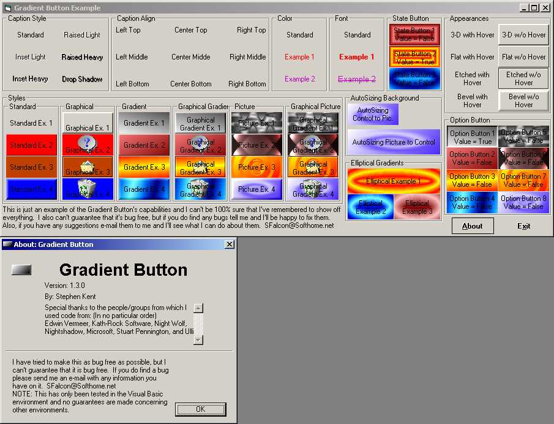



## Gradient Button v1\.3\.0

### Description

This button was created to be an enhanced replacement for Visual Basic's standard command button by adding more options, visual effects, and compatibility. I cannot guarantee that this code is bug free although I have made every attempt to make it such. If you have any problems with this code please contact me and I'll do what I can to help you through the problem.

Release 1.3.0:

+ New:

- Added Picture Alignment (Thanks Edwin Vermeer)

- Added Elliptical and Box Gradients

- Added Caption and Picture Alignment Cushions (Almost like margins)

- Added BackGround/Control Autosizing (Picture Modes)

- Added HSL Gradient Blending (Thanks Ulli & Edwin Vermeer)

- Added Gradient Repetitions (Thanks Edwin Vermeer)

- Added Hover options which allow Full Hover Effects / Border Only Hover / All Hover Effects except Border

- Added Mouse Pointer/Icon handling for Disabled, Down, and Hover states.

+ Fixed:

- Bug in Enabled Property (Design Mode, Control would appear enabled even though control was disabled after a form with control on it was closed then re-opened, Bug has present since Release 1.0.0) (Thanks for reporting problem, Edwin Vermeer)

- Bug in scaling that would cause the button to crash when placed on a parent that did not have ScaleMode available (PictureBox on an MDI form, etc...). Now if Parent.ScaleMode is not available button will scale co-ordinates to Twips (Thanks for reporting problem, costamar)

- Bug in ToolTips that would cause button to crash when used in environments without the extender object (Access VBA, etc...) (Thanks for reporting problem, Edwin Vermeer)

+ Improved:

- Caption Alignment has been improved to allow for positioning in any of 9 different positions [Changed existing enumeration which will cause some problems when upgrading] (Left Top / Left Middle / Left Bottom / Center Top Center Middle / Center Bottom / Right Top / Right Middle / Right Bottom)

- Enabled/Disabled coding to allow more control over the Disabled state of the control. Now prevents event processing instead of disabling the user control.

- ToolTips to allow using ToolTips in environments that don't support the Extender.
 
### More Info
 

             |
---                |---
**Submitted On**   |2001-05-02 06:44:30
**By**             |[Stephen Kent](https://github.com/Planet-Source-Code/PSCIndex/blob/master/ByAuthor/stephen-kent.md)
**Level**          |Advanced
**User Rating**    |4.1 (45 globes from 11 users)
**Compatibility**  |VB 6\.0
**Category**       |[Custom Controls/ Forms/  Menus](https://github.com/Planet-Source-Code/PSCIndex/blob/master/ByCategory/custom-controls-forms-menus__1-4.md)
**World**          |[Visual Basic](https://github.com/Planet-Source-Code/PSCIndex/blob/master/ByWorld/visual-basic.md)
**Archive File**   |[Gradient B191365320\.zip](https://github.com/Planet-Source-Code/stephen-kent-gradient-button-v1-3-0__1-22839/archive/master.zip)

